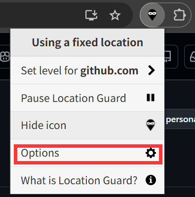
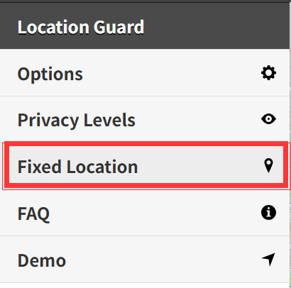
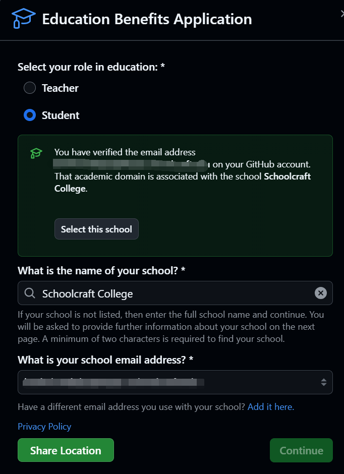
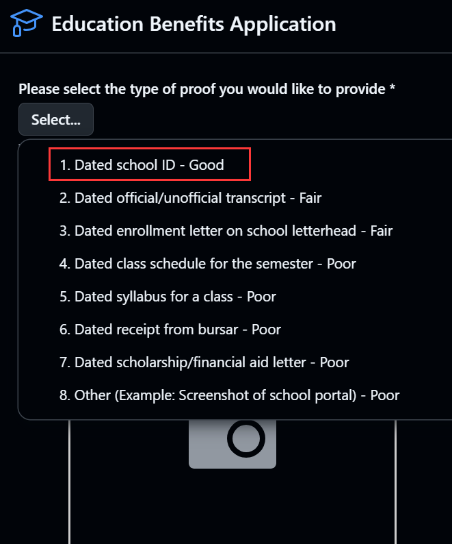
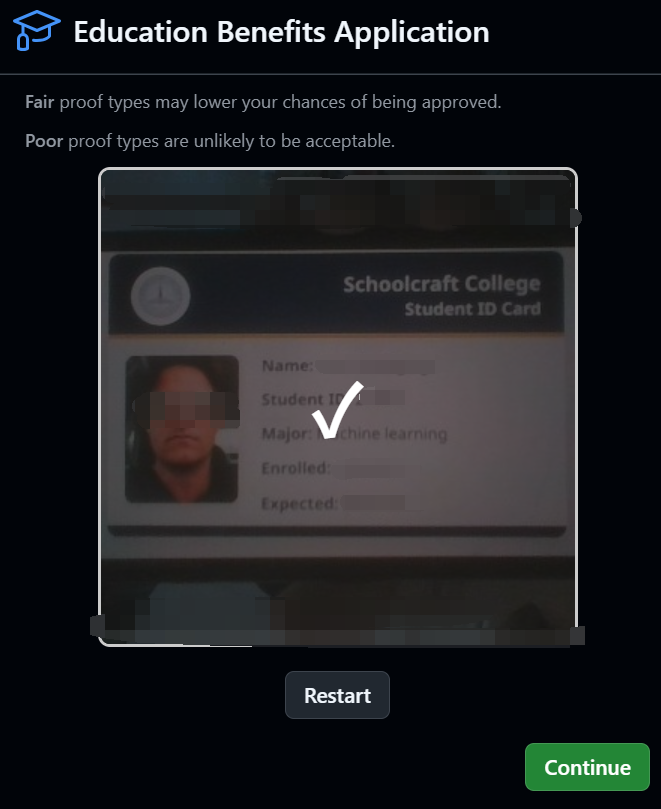
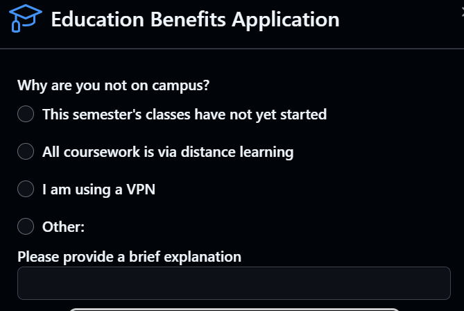
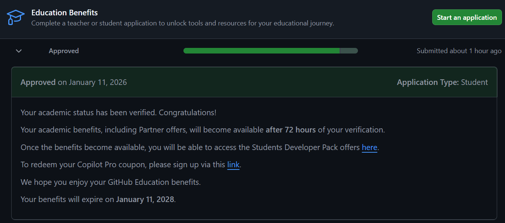
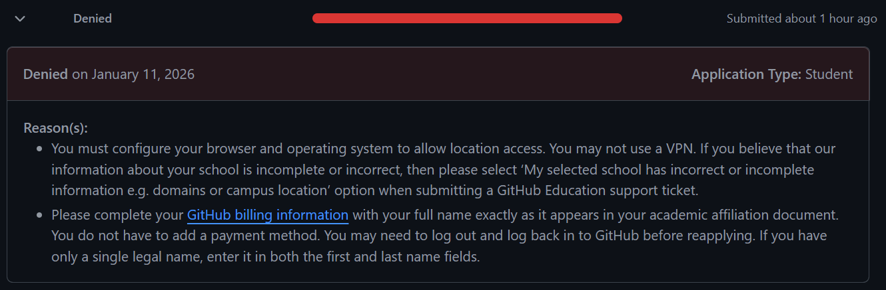

起因是这样的，我想用copilot写点代码，结果一下就用到了限额，根本不够用...
于是我便想起了Github还有个学生开发者包（GitHub Student Developer Pack），可以获得免费的github copilot pro
 > p.s
 > 我的github账号预先绑定过一个edu邮箱，未尝试无edu邮箱的情况，且该教程适用于有一定基础的群众

---

### 准备工作：
  1. [Location Guard插件](https://chromewebstore.google.com/detail/location-guard-v3/hhnhplojcganfmfimkeboiipphklcbih)，用于修改定位
  2. 一个[学生证](https://student-id.pages.dev/)图片（英文）
  3. 一个github账号

---

### 开始验证
  1. 前往 https://github.com/settings/profile 修改你的用户名为你准备的学生证上的名称
  2. 修改 Company 为你准备的学生证上的学校名称
  3. 前往 https://github.com/settings/billing/payment_information 修改Billing information为学生证上的名称，信息要对的上
  4. 前往 Location Guard插件的设置页面，配置好学生证上的地址
  5. 接下来调整默认级别为 Use fixed location
  6. 在左侧菜单中选择Fixed Location
  7. 地址改为学生证上的学校地址
  8. 前往 https://github.com/settings/education/benefits 进行申请
  9. 身份选择学生，然后选择学生证上的学校
  10. 点击 Share Location
  11. 点击 Continue
  12. 在下一个页面选择学生证 Dated school ID 
  13. 点击 start camera，这将会打开摄像头
  14. 将准备好的学生证图片展示在摄像头前面，要清晰
  15. 点击 Capture photo，这将会在3s后拍摄一张图片
  16. 点击Continue，不出意外的话你会看到这个提示：你为什么不在校园？（Whay are you not on campus）
  17. 选择Other或是All coursework is via distance learning 如果选择了Other理由写I am traveling
  18. 点击Smbmit application来提交申请
  19. 等待一段时间，刷新页面
  20. 如果看到Approved就是成功了，如果遇到denied拒绝的话就看详情，里面会有要求，照着做就好

---

### 总结
 Github学生包并非非常难通过，只要按照要求就可以轻松通过。
 欢迎在评论区交流！
