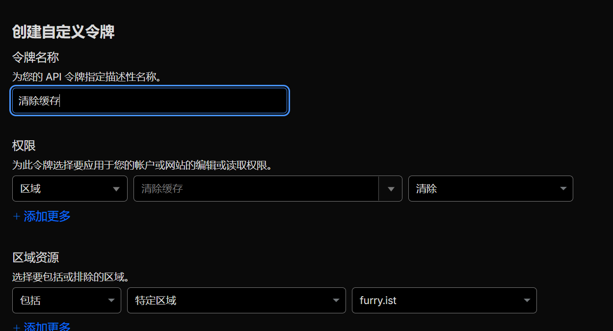
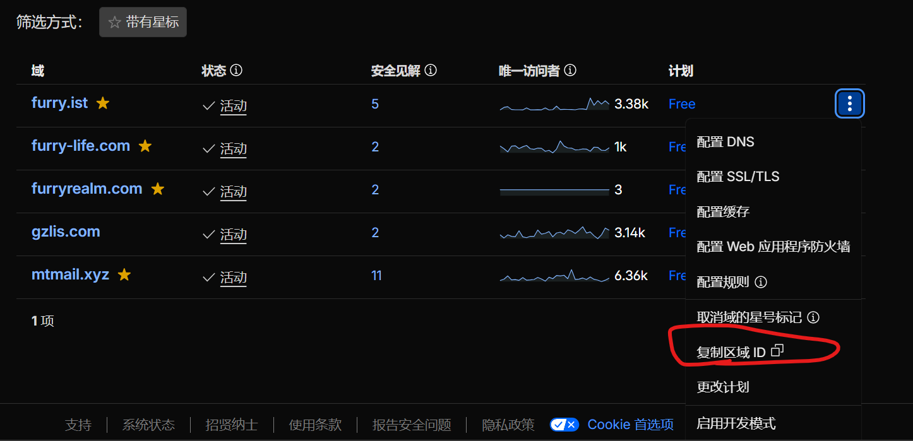
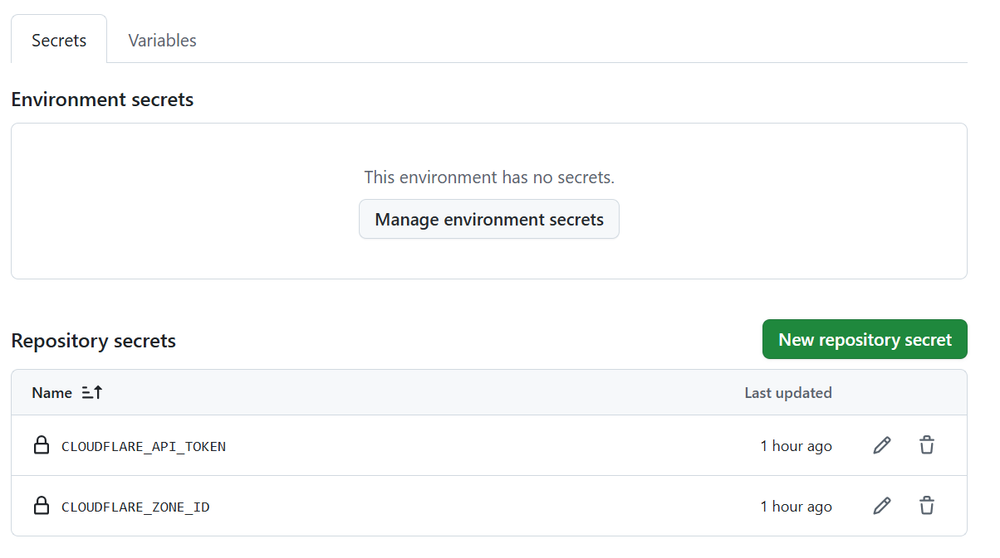
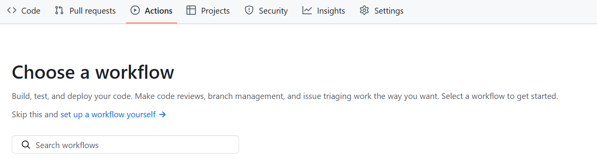

最近不是把博客迁移至了Fuwari吗？作为**纯静态**的博客，设置个合理的**缓存是非常重要的**，但是我既不想每次更新都**手动清理缓存**，也不想等待自然过期，这就会**丧失实时性**，因此在和 ai 讨论过后，我得到了一个合适的方法！

---

### 思路
众所周知，Github action是个可以在每次提交时都自动执行某些代码的东西。
那么，我们只需要写一个可以在每一次提交时，自动比对实际编译出来的时候，都有哪些文件被改变了，然后通过Cloudflare的api自动清除改变内容了的url即可！

---

### 准备工作
1. Cloudflare API Token （清除缓存权限） 如图：
2. 绑定在博客的域名的Zone ID （Zone ID获取方式如图）
3. Github actions

---

### 部署细则
1. 前往 https://github.com/[你的用户名]/[你的博客仓库]/settings/secrets/actions 并设置 Repository secrets
2. 将你在准备中获得的Cloudflare api token填入secret中，名称为CLOUDFLARE_API_TOKEN
3. 将你的Zone ID也填入secret中，名称为CLOUDFLARE_ZONE_ID
4. 设置好的示例如图： 
5. 前往你的 action 页面，点击 New workflow
6. 接下来你会看到一个 Choose a workflow界面，在这里点击 set up a workflow your self
7. 接下来，在编辑器内填入以下代码
8.  
   ```yaml
name: Purge Cloudflare Changed HTML Pages (fast)

on:
  push:
    branches: ["main"]
  workflow_dispatch:

permissions:
  contents: read

jobs:
  purge:
    runs-on: ubuntu-latest

    steps:
      - name: Checkout (full history for diff)
        uses: actions/checkout@v4
        with:
          fetch-depth: 0

      # 0) 先判断：这次提交是否可能影响 HTML（不影响就直接结束）
      - name: Detect whether HTML can be affected
        id: detect
        env:
          BEFORE_SHA: ${{ github.event.before }}
          AFTER_SHA: ${{ github.sha }}
        run: |
          python3 - <<'PY'
          import os, subprocess, sys

          before = os.environ.get("BEFORE_SHA", "").strip()
          after  = os.environ.get("AFTER_SHA", "").strip()
          out_path = os.environ.get("GITHUB_OUTPUT", "").strip()

          def write_output(k, v):
            if not out_path:
              return
            with open(out_path, "a", encoding="utf-8") as f:
              f.write(f"{k}={v}\n")

          # 无法可靠 diff（第一次 push / force push / workflow_dispatch 等）时：保守认为会影响
          can_diff = bool(before) and before != "0000000000000000000000000000000000000000"
          if not can_diff:
            write_output("CHANGED_COUNT", 0)
            write_output("SHOULD_RUN", "true")
            write_output("REASON", "no-before-sha")
            sys.exit(0)

          out = subprocess.check_output(["git", "diff", "--name-only", before, after], text=True).strip()
          changed = [x.strip() for x in out.splitlines() if x.strip()]

          affect_prefixes = (
            "src/pages/",
            "src/content/",
            "content/",
            "src/layouts/",
            "src/components/",
            "src/middleware/",
          )
          affect_files = (
            "astro.config.mjs",
            "astro.config.js",
            "package.json",
            "pnpm-lock.yaml",
            "vite.config.js",
            "vite.config.ts",
            "tailwind.config.js",
            "tailwind.config.cjs",
          )

          should = any((f in affect_files) or f.startswith(affect_prefixes) for f in changed)

          write_output("CHANGED_COUNT", len(changed))
          write_output("SHOULD_RUN", "true" if should else "false")
          write_output("REASON", "html-affected" if should else "no-html-affect")
          PY

      - name: Stop early if HTML not affected
        if: steps.detect.outputs.SHOULD_RUN != 'true'
        run: |
          echo "✅ No HTML-affecting changes. Skip build & purge."

      # 1) 只有在需要时才继续（省时间关键）
      - name: Setup Node.js
        if: steps.detect.outputs.SHOULD_RUN == 'true'
        uses: actions/setup-node@v4
        with:
          node-version: "20"

      - name: Setup pnpm
        if: steps.detect.outputs.SHOULD_RUN == 'true'
        uses: pnpm/action-setup@v4
        with:
          version: "9"

      # pnpm store 缓存（加速安装，通常收益很大）
      - name: Get pnpm store path
        if: steps.detect.outputs.SHOULD_RUN == 'true'
        id: pnpm-store
        run: echo "STORE_PATH=$(pnpm store path --silent)" >> "$GITHUB_OUTPUT"

      - name: Cache pnpm store
        if: steps.detect.outputs.SHOULD_RUN == 'true'
        uses: actions/cache@v4
        with:
          path: ${{ steps.pnpm-store.outputs.STORE_PATH }}
          key: pnpm-store-${{ runner.os }}-${{ hashFiles('pnpm-lock.yaml') }}
          restore-keys: |
            pnpm-store-${{ runner.os }}-

      - name: Install dependencies
        if: steps.detect.outputs.SHOULD_RUN == 'true'
        run: pnpm install --frozen-lockfile

      # 2) 恢复上一次 dist（用于对比哪些 HTML 变了）
      - name: Restore previous dist (for diff)
        if: steps.detect.outputs.SHOULD_RUN == 'true'
        uses: actions/cache@v4
        with:
          path: dist_prev
          key: dist-prev-${{ runner.os }}-${{ github.ref_name }}-${{ github.sha }}
          restore-keys: |
            dist-prev-${{ runner.os }}-${{ github.ref_name }}-
            dist-prev-${{ runner.os }}-

      # 3) Build 一次，产物放 dist_new
      - name: Build (Astro)
        if: steps.detect.outputs.SHOULD_RUN == 'true'
        run: |
          pnpm build
          rm -rf dist_new
          mv dist dist_new

      # 4) 生成 purge 列表（只 HTML，只变化的；全站影响则 purge 全部 HTML）
      - name: Plan purge URLs (changed HTML only)
        if: steps.detect.outputs.SHOULD_RUN == 'true'
        env:
          SITE_ORIGIN: https://blog.furry.ist
          BEFORE_SHA: ${{ github.event.before }}
          AFTER_SHA: ${{ github.sha }}
        run: |
          python3 - <<'PY'
          import os, json, pathlib, hashlib, subprocess

          site = os.environ.get("SITE_ORIGIN", "https://blog.furry.ist").rstrip("/")
          before = os.environ.get("BEFORE_SHA", "").strip()
          after  = os.environ.get("AFTER_SHA", "").strip()

          dist_prev = pathlib.Path("dist_prev")
          dist_new  = pathlib.Path("dist_new")

          def sha256_file(p: pathlib.Path) -> str:
            h = hashlib.sha256()
            with p.open("rb") as f:
              for chunk in iter(lambda: f.read(1024 * 1024), b""):
                h.update(chunk)
            return h.hexdigest()

          def to_url(p: pathlib.Path, base: pathlib.Path) -> str:
            rel = p.relative_to(base).as_posix()
            if rel == "index.html":
              return f"{site}/"
            if rel.endswith("/index.html"):
              route = rel[:-len("/index.html")]
              return f"{site}/{route}/"
            return f"{site}/{rel}"

          if not dist_new.exists():
            raise SystemExit("❌ dist_new not found. build failed?")

          # 判断是否“全站渲染影响”（layout/component/config 等）
          global_affect_prefixes = (
            "src/layouts/",
            "src/components/",
            "src/middleware/",
          )
          global_affect_files = (
            "astro.config.mjs",
            "astro.config.js",
            "package.json",
            "pnpm-lock.yaml",
            "vite.config.js",
            "vite.config.ts",
            "tailwind.config.js",
            "tailwind.config.cjs",
          )

          global_purge = False
          can_diff = bool(before) and before != "0000000000000000000000000000000000000000"
          if can_diff:
            try:
              out = subprocess.check_output(["git", "diff", "--name-only", before, after], text=True).strip()
              changed = [x.strip() for x in out.splitlines() if x.strip()]
              for f in changed:
                if f in global_affect_files or f.startswith(global_affect_prefixes):
                  global_purge = True
                  break
            except Exception:
              # diff 失败：保守处理交给后续 has_prev/global_purge 分支
              pass

          new_html = sorted(dist_new.rglob("*.html"))
          new_map = {p.relative_to(dist_new).as_posix(): p for p in new_html}

          has_prev = dist_prev.exists() and any(dist_prev.iterdir())

          if not has_prev or global_purge:
            # 没有 prev 或全站影响：purge 所有 HTML（仍然只 HTML）
            urls = [to_url(p, dist_new) for p in new_html]
            plan = {
              "mode": "all_html",
              "count": len(urls),
              "urls": urls,
              "reason": "no-prev-dist" if not has_prev else "global-affect-changes",
            }
          else:
            prev_html = list(dist_prev.rglob("*.html"))
            prev_map = {p.relative_to(dist_prev).as_posix(): p for p in prev_html}

            urls = []

            # 新增/变更
            for rel, p in new_map.items():
              old = prev_map.get(rel)
              if old is None or sha256_file(p) != sha256_file(old):
                urls.append(to_url(p, dist_new))

            # 删除（旧有新无）：也要 purge 对应 URL（避免边缘节点还留旧页）
            deleted = set(prev_map.keys()) - set(new_map.keys())
            for rel in sorted(deleted):
              if rel == "index.html":
                urls.append(f"{site}/")
              elif rel.endswith("/index.html"):
                route = rel[:-len("/index.html")]
                urls.append(f"{site}/{route}/")
              else:
                urls.append(f"{site}/{rel}")

            # 去重
            dedup, seen = [], set()
            for u in urls:
              if u not in seen:
                seen.add(u)
                dedup.append(u)

            plan = {
              "mode": "changed_only",
              "count": len(dedup),
              "urls": dedup,
              "reason": "hash-diff-dist-html",
            }

          out = json.dumps(plan, ensure_ascii=False)
          print(out)
          with open("plan.json", "w", encoding="utf-8") as f:
            f.write(out)
          PY

      # 5) 调用 Cloudflare Purge by URL（每批 30）
      - name: Purge Cloudflare cache by URL (batched)
        if: steps.detect.outputs.SHOULD_RUN == 'true'
        env:
          CLOUDFLARE_ZONE_ID: ${{ secrets.CLOUDFLARE_ZONE_ID }}
          CLOUDFLARE_API_TOKEN: ${{ secrets.CLOUDFLARE_API_TOKEN }}
        run: |
          python3 - <<'PY'
          import os, json, urllib.request, sys, urllib.error

          zone_id = (os.environ.get("CLOUDFLARE_ZONE_ID") or "").strip()
          token   = (os.environ.get("CLOUDFLARE_API_TOKEN") or "").strip()

          if not zone_id or not token:
            raise SystemExit("❌ Missing CLOUDFLARE_ZONE_ID or CLOUDFLARE_API_TOKEN secrets.")

          with open("plan.json", "r", encoding="utf-8") as f:
            plan = json.load(f)

          urls = plan.get("urls", [])

          if not urls:
            print("✅ No changed HTML pages to purge.")
            sys.exit(0)

          endpoint = f"https://api.cloudflare.com/client/v4/zones/{zone_id}/purge_cache"

          def purge(batch):
            body = json.dumps({"files": batch}).encode("utf-8")
            req = urllib.request.Request(
              endpoint,
              data=body,
              method="POST",
              headers={
                "Content-Type": "application/json",
                "Authorization": f"Bearer {token}",
              },
            )
            try:
              with urllib.request.urlopen(req, timeout=30) as resp:
                data = json.loads(resp.read().decode("utf-8"))
            except urllib.error.HTTPError as e:
              detail = e.read().decode("utf-8", errors="replace")
              raise SystemExit(f"❌ Purge HTTP error: {e.code}\n{detail}")
            except Exception as e:
              raise SystemExit(f"❌ Purge request failed: {e}")

            if not data.get("success"):
              raise SystemExit("❌ Purge failed: " + json.dumps(data, ensure_ascii=False))

          # 按 30 分批更稳
          batch_size = 30
          for i in range(0, len(urls), batch_size):
            batch = urls[i:i + batch_size]
            purge(batch)
            print(f"🧹 Purged {i + 1}-{i + len(batch)} / {len(urls)}")

          print(f"🎉 Done. Purged {len(urls)} URLs.")
          PY

      # 6) 更新 dist 缓存：本次 dist_new 作为下次 dist_prev
      - name: Save dist for next run (as dist_prev)
        if: steps.detect.outputs.SHOULD_RUN == 'true'
        run: |
          rm -rf dist_prev
          mv dist_new dist_prev

```

 9. 点击 Commit changes
 10. 再次点击 Commit changes
 11. 提交一个新文件试试效果吧！

---

### 总结
通过GitHub action 我们可以实现全自动清理Cloudflare的缓存，保证了我们博客的实时性，也方便了我们查看对于博客的更改！

